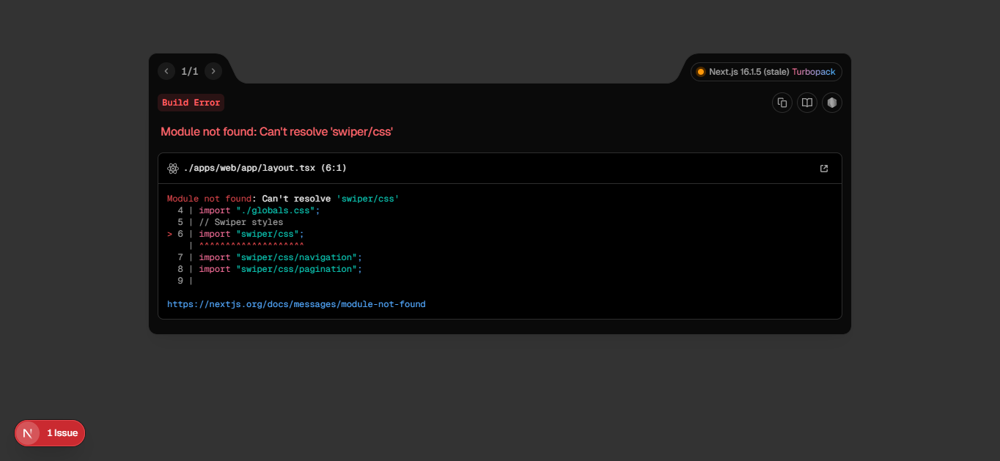

# RoPhim - NextJS Monorepo Demo 🎬

Dự án sử dụng kiến trúc **Monorepo** chuyên nghiệp, được tối ưu hóa cho hiệu suất và khả năng mở rộng.

## 📂 Cấu trúc thư mục (Folder Structure)

```text
rophim-monorepo/
├── apps/
│   ├── web/          # Next.js Front-end (Main App)
│   └── server/       # NestJS Back-end (API Server)
├── packages/
│   ├── ui/           # Shared UI Components
│   ├── eslint-config/# Shared Linting Rules
│   └── typescript-config/ # Shared TS Definitions
├── package.json      # Workspace Root
├── turbo.json        # Turborepo Config
└── pnpm-workspace.yaml
```

## 🛠️ Công nghệ sử dụng
- **Quản lý Monorepo:** Turborepo & pnpm Workspaces
- **Front-end:** Next.js (App Router)
- **Back-end:** NestJS
- **UI:** Tailwind CSS v4

---

## 📸 Demo Giao Diện



---
*Phát triển bởi **locfaker (@locv2659@gmail.com)**.*
